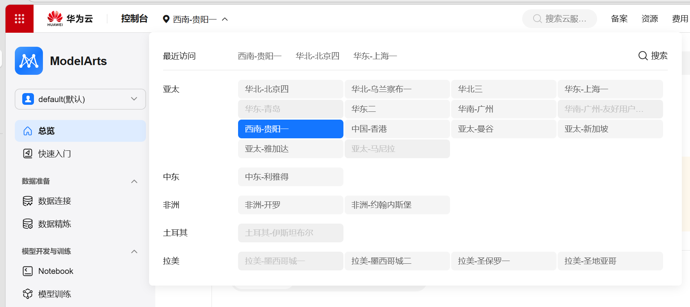
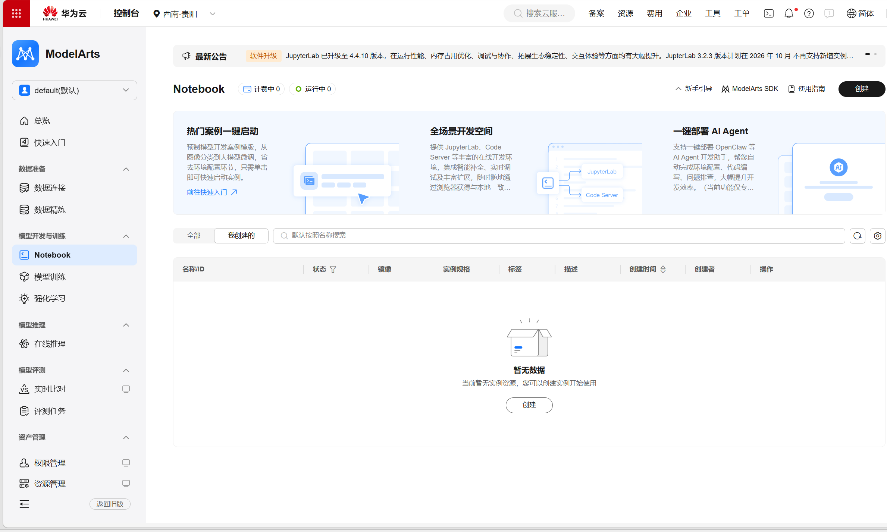
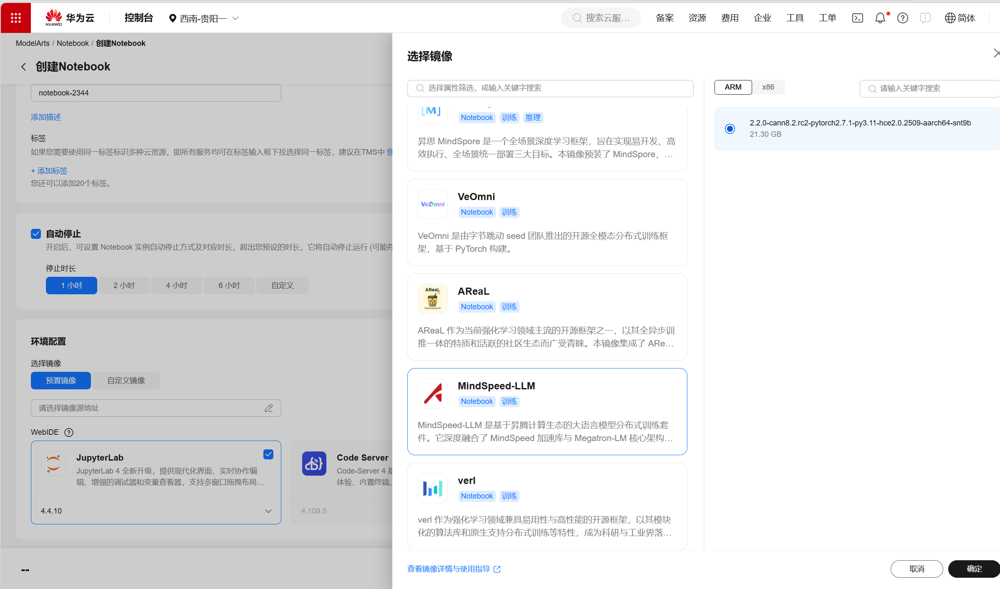
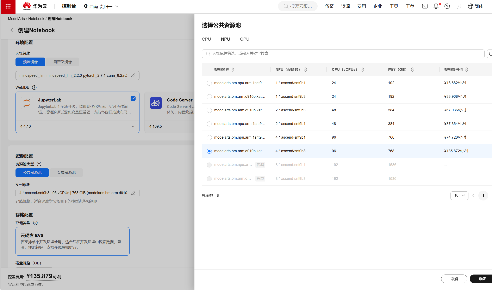

# Lab 6：集群混合并行训练

## 实验目标

- 在 ModelArts 的单机 4 卡 Ascend 910B 实例上配置 MindSpeed-LLM 训练环境。
- 将 Qwen2.5-7B 的 HuggingFace 权重转换为 TP=2、PP=2 的 Megatron 权重分片，并完成 Alpaca 数据预处理。
- 启动 Qwen2.5-7B 多卡训练，从日志中读取 loss、吞吐和单步耗时。

## 实验环境

实验在华为云 ModelArts 的 Notebook 环境中完成，浏览器内使用 JupyterLab。

| 项目 | 配置 |
| --- | --- |
| 区域 | 西南-贵阳一 |
| 资源池 | 公共资源池 |
| 规格 | 4×Ascend 910B，单卡 64GB HBM2e |
| 镜像 | `mindspeed_llm_2.2.0` 公共镜像，AI 引擎选择 MindSpeed-LLM |
| 存储 | EVS，50GB 以上 |
| Python | 3.11.10 |
| PyTorch | 2.7.1 + `torch_npu` |
| 训练框架 | MindSpeed-LLM 2.2.0 |

镜像预装 PyTorch、`torch_npu`、MindSpeed-LLM、transformers 和 matplotlib。首次下载模型时，Notebook 会安装 modelscope。镜像 tag 中的 `cann_8.2.rc2` 是历史命名，实际 CANN 版本以镜像详情页“AI 引擎及框架”中的信息为准。

`/home/ma-user/work/` 是 EVS 持久化目录。模型权重、数据、权重转换产物和训练日志都保存在这里。

### 创建 ModelArts 环境

1. 在华为云控制台切换到“西南-贵阳一”。

   

2. 进入 ModelArts，选择“开发环境 → Notebook”，创建实例。

   

3. 选择 `mindspeed_llm_2.2.0-...` 公共镜像，在 AI 引擎中选择 MindSpeed-LLM。

   

4. 选择公共资源池、4×Ascend 910B 规格，并配置 50GB 以上的 EVS 存储。

   

5. 实例启动后，点击“接入环境”进入 JupyterLab，将整个实验目录上传到 `/home/ma-user/work/`。

   

## 实验原理

Qwen2.5-7B 需要在 4 张 NPU 上进行混合并行训练。本实验使用 TP=2、PP=2、DP=1：张量并行将层内权重分到两张卡，流水线并行将 28 层模型分为两个 stage，数据并行度为 1。

全局批次为 GBS=64，微批次为 MBS=1，因此梯度累积步数为 GAS = 64 / (1 × 1) = 64。每张卡连续累积 64 个微批次后更新参数。流水线气泡占比约为 `(PP - 1) / (GAS + PP - 1) = 1 / 65`。

HuggingFace 权重是完整模型权重。MindSpeed-LLM 训练前需要按 TP 和 PP 切分为 Megatron 格式，每张卡加载对应分片。Alpaca 的 parquet 数据会通过 `preprocess_data.py` 转为 `.bin` 数据文件和 `.idx` 索引文件。

## 实验流程

在 [06.01_mindspeed_training_config_and_launch.ipynb](06.01_mindspeed_training_config_and_launch.ipynb) 中按顺序执行以下步骤。

| 步骤 | 内容 |
| --- | --- |
| 1 | 初始化工作目录与 TP、PP、DP 参数 |
| 2 | 下载 Qwen2.5-7B 权重和 Alpaca 数据 |
| 3 | 检查 NPU、`torch_npu` 与 HCCL AllReduce 通信 |
| 4 | 将 HuggingFace 权重转换为 Megatron 权重分片 |
| 5 | 将 Alpaca 数据转为 `.bin` 和 `.idx` 文件 |
| 6 | 生成训练脚本，在 JupyterLab 终端启动训练 |
| 7 | 解析训练日志并绘制 loss 曲线 |

训练脚本生成后，在 JupyterLab 中打开终端并执行：

```bash
cd /home/ma-user/MA_Turbo/src/open_source/MindSpeed-LLM
bash /home/ma-user/work/l06_workspace/output_tp2_pp2/run_train.sh
```

`iteration 1` 日志中的 `lm loss` 表示训练已开始。训练日志写入 `output_tp2_pp2/run_log`，Notebook 最后的日志解析单元会提取 loss、吞吐和单步耗时。

若下载模型时出现 `invalid literal for int(): 'ERROR'`，检查 `MODELSCOPE_LOG_LEVEL` 是否为数字字符串。若权重转换无法导入 `megatron`，Notebook 会按所需版本准备 Megatron-LM 依赖。训练启动时出现显存不足，可先检查 TP、PP 是否与转换配置一致，再根据运行情况调整 `seq_length` 或并行配置并重新转换权重。

## 实验总结

本实验使用 TP=2、PP=2 的单机 4 卡布局完成 Qwen2.5-7B 训练准备与启动。权重转换和训练必须使用同一组 TP、PP 参数；数据预处理生成的 `.bin`、`.idx` 文件由训练脚本通过 `--data-path` 读取。训练完成后，可从日志的 `lm loss`、吞吐和单步耗时观察训练过程。
